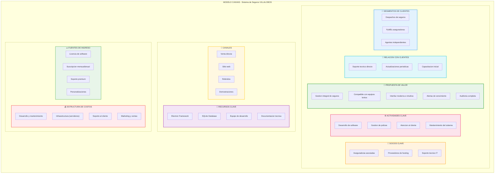
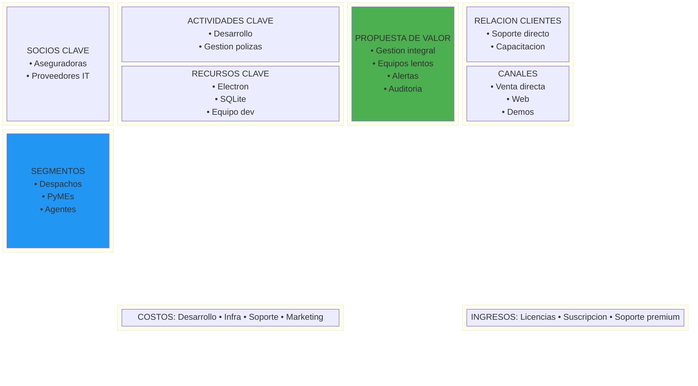

# Modelo Canvas - Sistema de Seguros VILLALOBOS

## Ejemplo de Modelo Canvas con Mermaid.js

El Business Model Canvas no tiene un tipo nativo en Mermaid, pero podemos representarlo usando un **diagrama de bloques** o **flowchart** estructurado.

### Opcion 1: Flowchart como Canvas



### Opcion 2: Diagrama de Bloques (Mas Simple)



---

## Como visualizar

### GitHub
Sube este archivo a GitHub - se renderiza automaticamente.

### VS Code
Extension: "Markdown Preview Mermaid Support"

### Online
https://mermaid.live/ - Pega el codigo y exporta PNG/SVG

### CLI
```bash
npm install -g @mermaid-js/mermaid-cli
mmdc -i EJEMPLO_CANVAS.md -o canvas.png -w 1200
```

---

## Nota sobre el Canvas

El Modelo Canvas tradicional tiene 9 bloques dispuestos en un layout especifico. Mermaid no tiene un tipo nativo "canvas", pero con `flowchart` y `subgraph` podemos aproximarlo bien.

Para un Canvas mas fiel al original, tambien podemos usar:
- **HTML/CSS Grid** - Control total del layout
- **PlantUML** - Con componentes personalizados
- **SVG directo** - Dibujo manual

¿Prefieres alguna de estas alternativas?
