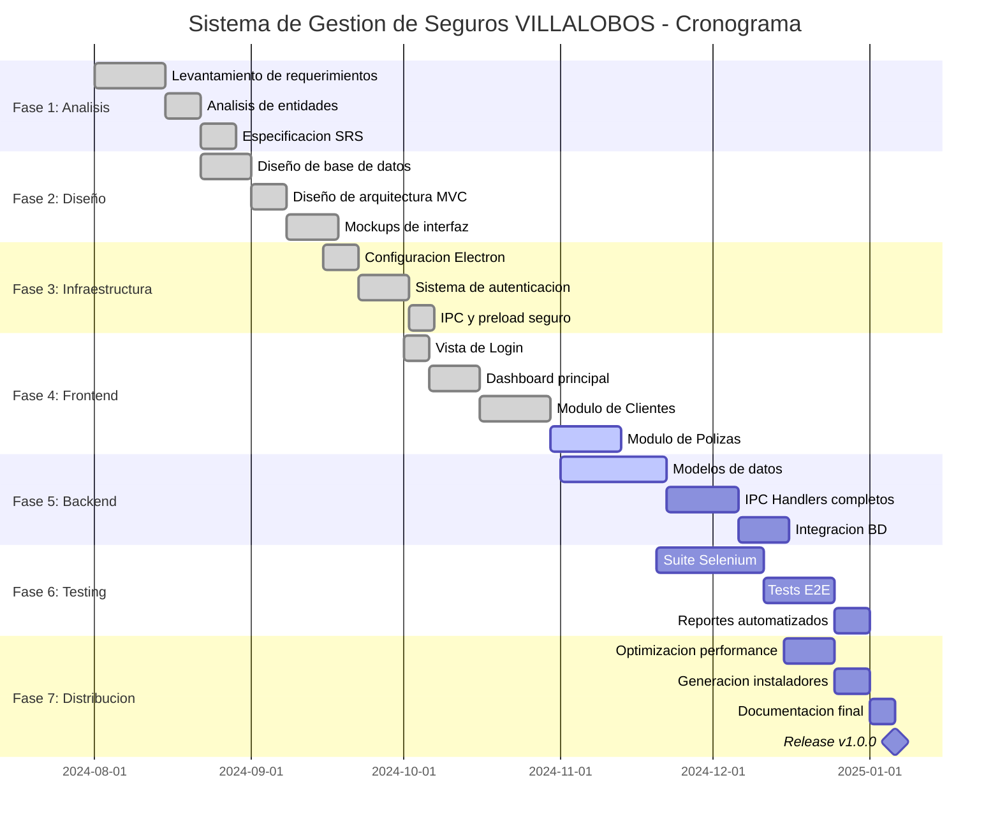

# Diagrama de Gantt - Sistema de Seguros VILLALOBOS

## Ejemplo de Diagrama de Gantt con Mermaid.js

Este es un ejemplo del diagrama de Gantt que muestra las fases del proyecto desde agosto 2024.



## Como visualizar este diagrama

### Opcion 1: GitHub
Sube este archivo `.md` a GitHub y el diagrama se renderizara automaticamente.

### Opcion 2: VS Code
Instala la extension "Markdown Preview Mermaid Support" y abre la preview.

### Opcion 3: Mermaid Live Editor
Copia el codigo entre las comillas y pegalo en: https://mermaid.live/

### Opcion 4: Exportar a imagen
Usa el Mermaid CLI:
```bash
npm install -g @mermaid-js/mermaid-cli
mmdc -i EJEMPLO_GANTT.md -o gantt.png
```

---

## Leyenda de estados

- `done` = Completado (verde)
- `active` = En progreso (azul)
- `crit` = Critico (rojo)
- Sin estado = Pendiente (gris)
